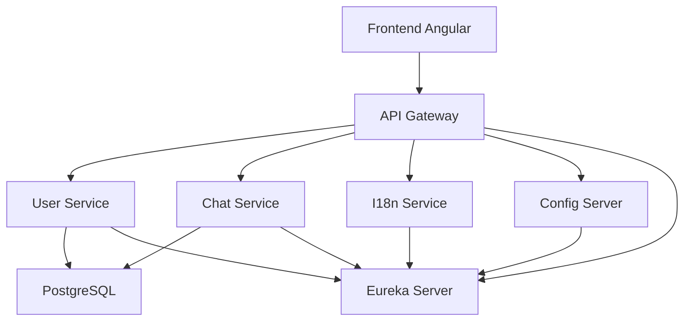

# Introduction

Dans le cadre du projet 7 ***"Concevez une solution d'architecture fonctionnelle pour une application full-stack"*** de la formation **"Architecte logiciel"**, il est demandé de produire un dossier d'architecture établissant une unification des différentes applications d'une société fictive "Your Car Your Way" ayant déjà plusieurs implémentation d'une aplication de location de voitures.

Dans le but de faire une preuve de concept (**POC**) de l'architecture, avec une application de chat.

# Stack Technique


# Description du projet

Le repo se compose de 5 projets Java indépendants + 1 projet Angular :
```
Poc-YcYw-Chat/
├── api-gateway/          # Spring Cloud Gateway
├── chat-service/         # WebSocket + messages
├── config-server/        # Spring Cloud Config
├── eureka-server/        # Découverte dynamique des API
├── i18n-service/         # Traductions, devises, formats
├── user-service/         # Auth + profil utilisateur
└── frontend/             # Angular
```

# Configuration des ports

| Service | Port | Url | Description |
|---|---|--|--|
| API Gateway | 8080 | http://localhost:8080 | Route vers tous les services |
| User Service | 8082 | http://localhost:8082/swagger-ui/index.html | Authentification & gestion utilisateurs |
| Chat Service | 8081 | http://localhost:8081/swagger-ui/index.html | Chat et messages |
| i18n Service | 8083 | http://localhost:8083/swagger-ui/index.html | Traductions & formats |
| Config Server | 15000 | http://localhost:15000/application/default | Configuration centralisée (Spring Cloud Config) |
| Eureka | 8761 | http://localhost:8761 | Service Discovery |
| PostgreSQL | 5432 | - | Base de données |
| Angular dev | 4200 | http://localhost:4200 | Frontend Chat |

# API Endpoints (à travers API Gateway)

## User Service (`/users`)

| Endpoint | Method | Description | Auth |
|---|---|---|---|
| `/users` | GET | Liste tous les utilisateurs | Token |
| `/users/{id}` | GET | Récupère un utilisateur | Token |
| `/users` | POST | Crée un nouvel utilisateur | ❌ |
| `/users/{id}` | DELETE | Supprime un utilisateur | Token |
| `/users/login` | POST | Connexion (retourne token) | ❌ |
| `/users/logout` | POST | Déconnexion | Token |
| `/users/me` | GET | Utilisateur courant | Token |

## Chat Service (`/chat`)
| Endpoint | Method | Description | Auth |
|---|---|---|---|
| `/chat` | GET | Healthcheck du service chat | ❌ |
| `/chat/channels` | GET | Liste les canaux | ❌ |
| `/chat/channels/{channelId}` | PUT | Crée/initialise un canal | ❌ |
| `/chat/channels/{channelId}/members` | POST | Rejoint un canal | ❌ |
| `/chat/channels/{channelId}/members/{username}` | DELETE | Quitte un canal | ❌ |
| `/chat/channels/{channelId}/messages` | POST | Envoie un message dans un canal | ❌ |
| `/chat/channels/{channelId}/messages?limit=50` | GET | Récupère l'historique (limite 1..200) | ❌ |

## i18n Service (`/i18n`)
| Endpoint | Method | Description | Auth |
|---|---|---|---|
| `/i18n/locales` | GET | Liste les locales supportées | ❌ |
| `/i18n/locale?locale=fr-FR` | GET | Infos d'une locale (formats + traductions) | ❌ |
| `/i18n/translate?locale=fr-FR&key=greeting` | GET | Traduit une clé | ❌ |
| `/i18n/format?locale=fr-FR&datetime=2026-03-16T15:34:00` | GET | Formatte une date/heure (ISO-8601) | ❌ |

**Request/Response Examples:**

### Login
```bash
curl -X POST http://localhost:8080/users/login \
  -H "Content-Type: application/json" \
  -d '{"username":"agent","password":"agent"}'

# Response: { "token": "token-..." }
```

### Get Current User
```bash
curl -X GET http://localhost:8080/users/me \
  -H "X-Auth-Token: token-..."
```

### Chat - créer un canal, rejoindre, envoyer, historique
```bash
# Créer/initialiser un canal
curl -X PUT http://localhost:8080/chat/channels/general

# Rejoindre un canal
curl -X POST http://localhost:8080/chat/channels/general/members \
  -H "Content-Type: application/json" \
  -d '{"username":"agent"}'

# Envoyer un message
curl -X POST http://localhost:8080/chat/channels/general/messages \
  -H "Content-Type: application/json" \
  -d '{"from":"agent","content":"hello"}'

# Historique (10 derniers)
curl -X GET "http://localhost:8080/chat/channels/general/messages?limit=10"
```

### i18n - locales, traduction, format
```bash
curl -X GET http://localhost:8080/i18n/locales

curl -X GET "http://localhost:8080/i18n/translate?locale=fr-FR&key=greeting"

curl -X GET "http://localhost:8080/i18n/format?locale=fr-FR&datetime=2026-03-16T15:34:00"
```

---

# Lancement de l'application complète

## 1️⃣ Démarrer la base de données
```bash
docker-compose up -d
```

## 2️⃣ Démarrer les services backend (dans l'ordre)

```bash
# Eureka Server
cd eureka-server
mvn org.springframework.boot:spring-boot-maven-plugin:3.4.1:run

# Config Server (nouvel onglet)
cd config-server
mvn org.springframework.boot:spring-boot-maven-plugin:3.4.1:run

# User Service (nouvel onglet)
cd user-service
mvn org.springframework.boot:spring-boot-maven-plugin:3.4.1:run

# Chat Service (nouvel onglet)
cd chat-service
mvn org.springframework.boot:spring-boot-maven-plugin:3.4.1:run

# I18n Service (nouvel onglet)
cd i18n-service
mvn org.springframework.boot:spring-boot-maven-plugin:3.4.1:run

# API Gateway (nouvel onglet)
cd api-gateway
mvn org.springframework.boot:spring-boot-maven-plugin:3.4.1:run
```

## 3️⃣ Démarrer le frontend Angular
```bash
cd frontend
npm install
npm start
```

L'application sera accessible à **http://localhost:4200**

---

# Comptes de démonstration

| Username | Password | Rôle |
|---|---|---|
| agent | agent | AGENT |
| client | client | CLIENT |

---

# Architecture Chat

- **Frontend**: Angular 19+ (Couleurs: Orange #FF6B35, Bleu #004E89)
- **Communication**: API Gateway → User Service + Chat Service
- **Auth**: Token-based via header `X-Auth-Token`
- **State Mgmt**: RxJS BehaviorSubjects
- **UI Features**:
  - Sidebar avec liste utilisateurs connectés
  - Affichage des messages avec timestamps
  - Rôles visuellement différenciés (Agent orange, Client bleu)
  - Déconnexion utilisateur


# Diagramme de Flux



# Scéma de la structure des données:
```mermaid
class User {
        +int id
        +string email
        +string first_name
        +string last_name
        +string password_hash
        +Enum role
        +bool is_psh_profile
    }
    
    class Agency {
        +int id
        +string name
        +string city
        +string timezone
    }
    
    class Vehicle {
        +int id
        +string acriss_code
        +string brand
        +string model
        +Enum status
        +float price_per_day
    }
    
    class Reservation {
        +int id
        +datetime start_date
        +datetime end_date
        +float amount
        +string payment_id
        +Enum status
    }

        class ChatSession {
        +uuid session_id
        +int user_id? 
        +string guest_name?
        +datetime created_at
        +string country_code
        +Enum status
    }

    class ChatMessage {
        +int id
        +uuid session_id
        +int sender_id?
        +string content
        +datetime timestamp_utc
        +string language_code
    }

    User "0..1" -- "*" ChatSession : initie (si connecté)
    ChatSession "1" -- "*" ChatMessage : contient
    User "0..1" -- "*" ChatMessage : envoie (Agent ou Client)

    User "1" -- "*" Reservation : effectue
    Agency "1" -- "*" Vehicle : possède
    Vehicle "1" -- "*" Reservation : est loué

```
