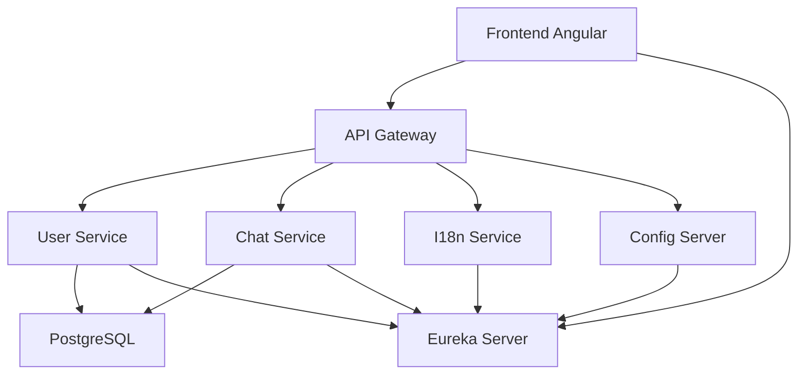

# Introduction

Dans le cadre du projet 7 ***"Concevez une solution d'architecture fonctionnelle pour une application full-stack"*** de la formation **"Architecte logiciel"**, il est demandé de produire un dossier d'architecture établissant une unification des différentes applications d'une société fictive "Your Car Your Way" ayant déjà plusieurs implémentation d'une aplication de location de voitures.

Dans le but de faire une preuve de concept (**POC**) de l'architecture, avec une application de chat.

# Stack Technique


# Description du projet

Le repo se compose de 5 projets Java indépendants + 1 projet Angular :
```
Poc-YcYw-Chat/
├── api-gateway/          # Spring Cloud Gateway
├── config-server/        # Spring Cloud Config
├── user-service/         # Auth + profil utilisateur
├── chat-service/         # WebSocket + messages
├── i18n-service/         # Traductions, devises, formats
└── frontend/             # Angular
```

# Configuration des ports

| Service | Port |
|---|---|
| API Gateway | 8080 |
| Chat Service | 8081 |
| User Service | 8082 |
| i18n Service | 8083 |
| Config Server | 15000 |
| Eureka | 8761 |
| PostgreSQL | 5432 |
| Angular dev | 4200 |

# Lancement des services

1. Démarrer PostgreSQL : `docker-compose up -d`
2. Démarrer Eureka Server : `cd eureka-server && mvn spring-boot:run`
3. Démarrer Config Server : `cd config-server && mvn spring-boot:run`
4. Démarrer les autres services dans l'ordre : user-service, chat-service, i18n-service, api-gateway
5. Démarrer le frontend : `cd frontend && npm start`


# Diagramme de Flux


